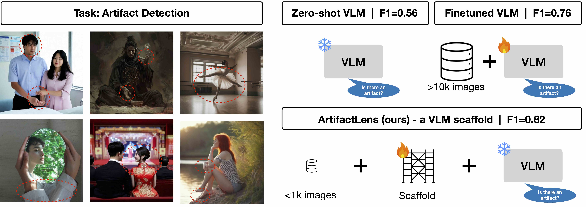

# ArtifactLens

This is the repo for the paper [ArtifactLens](https://arxiv.org/abs/2602.09475).

> Pretrained VLMs already know how to detect artifacts in AI-generated images. With the right scaffolding, this capability can be unlocked using only a few hundred labeled examples, achieving state-of-the-art on five benchmarks while requiring orders of magnitude less data than fine-tuning.

We are unable currently to release code artifacts at the moment, though we will release them if we can.

However the ideas are relatively simple, so if you point your agent at [the paper](https://arxiv.org/abs/2602.09475), they should be able to implement it!
